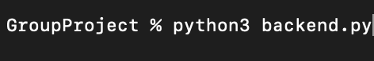
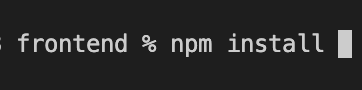
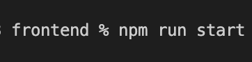
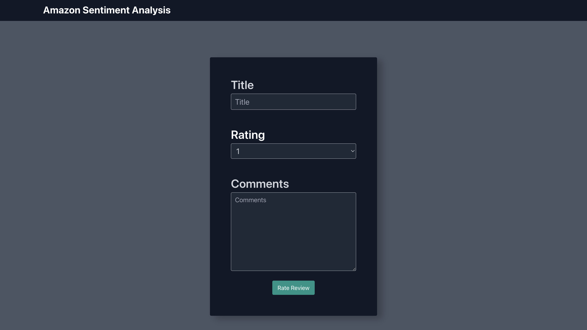

# Instant Sentimental Analysis Feedback
*This is the final course project for **CS 410 - Text Retrieval & Mining** course at the University of Illinois at Urbana-Champaign. - Fall 2023*

We provide you a tool to give instant sentiment analysis on the submitted review regarding the sentiment levels (Positive, Negative or Neutral).
A marketing or product research personel or department can integrate this tool to develop a batch processing feature that intakes a dataset of reviews and outputs a corresponding list of sentiments. Based on how they analyze this output, it can be beneficial to investigate the overall trend, the outliers, or interesting observation, for further improvements or other decision on the products/services.

**Video Demo Presentation:** https://youtu.be/76HLnHLKslo

### Project team
- Ethan Shen: ethans11@illinois.edu
- Matt Macrides: mbm12@illinois.edu
- Ajay Ramsunder: ajayr4@illinois.edu
- Huyen Lai: hlai9@illinois.edu

## Background/Problem Statement:
- Technical errors or user mistakes can lead to reviews not matching the ratings given on a product/service.
- Sentimental analysis model can be time consuming to build, and getting proper dataset to train the model can be challenging.
- We also notice a general skewing trend in the positive versus negative or neutral reviews so to get a balanced learning is another challenge.
- It would be useful to have a ready-to-use application that employs a model which has been trained and evaluated at relatively high performance score, to obtain instant sentimental feedback on the given review. Based on this it can open door to developing higher capacity application to batch-process reviews and more.
  
## System requirements and Usage
### Pre-requisites
- Python/NLP Packages: [requests_html](https://pypi.org/project/requests-html/),  [NumPy](http://www.numpy.org), [Pandas](https://pandas.pydata.org), [beautifulsoup](https://pypi.org/project/beautifulsoup4/), [nltk](https://www.nltk.org/), [matplotlib](https://matplotlib.org/)
- sklearn including vectorization and linear models: [scikitlearn](https://scikit-learn.org/stable/)
- XGBoost Model: [XGBoost](https://xgboost.readthedocs.io/en/stable/python/python_intro.html)
- Model extractor: [joblib](https://joblib.readthedocs.io/en/stable/)
- Frontend Packages: [ReactJS](https://react.dev/), [TailwindCSS](https://tailwindui.com/)
- Backend: [Flask](https://flask.palletsprojects.com/en/3.0.x/)

### Delivery Tool 
- The main deliverable of this project is the UI application.
- We also have the model building and evaluation steps in the provided python notebooks SentimentAnalysis.ipynb.
- All the project files are contained in the **Group Project** folder and its subfolders
>>- Data folder with crawled reviews from different 
>>- README.md
>>- SentimentAnalysis.ipynb
>>- backend.py
>>- extractReviews.py
>>- unigram_xgboost_oversample.joblib
>>- vectorizer.joblib
>>- frontend js files

### How to use
#### Launch the backend
- Launch a new terminal 
- Navigate to the GroupProject folder in the terminal
- Install python 3 if you do not have it
- [Install Python](https://www.python.org/downloads/)
- Run the command "python3 backend.py"

#### Launch the UI 
- Launch a new terminal that is not running the backend 
- Navigate in your terminal to the frontend folder
- If this is your first time running the code, make sure that you have node.js and npm installed on your machine
- [Install NPM](https://docs.npmjs.com/downloading-and-installing-node-js-and-npm)
- Still only do this if it is your first time running the code, run the command "npm install" as seen below 

- Once the previous step is run, every time in order to run the UI run the command "npm run start"

#### Now the frontend will launch and reviews can be fed in it will look like below

### Code Walk through

**extractReviews.py**
- Using Python packages requests_html and pandas to extract data from HTML pages into a .csv file with the following details:
>- Title: Title of Review
>- Rating: Rating of Review from 1-5
>- Comment: Body of the User Review
>- asin_number: Amazon Standard Identification Number (unique product code)
- extractReviews.py scrapes 300 unique products on Amazon and extracts roughly 3,000 user reviews (10 per product) into reviews.csv. Additionally, we append roughly 5,000 more user reviews from more_reviews.csv (https://www.kaggle.com/datasets/tarkkaanko/amazon?select=amazon_reviews.csv) into the main review csv. 

**SentimentAnalysis.ipynb**
- Data Mining and Model Building: Data Preprocessing - we used pandas methods to clean up and remove null data and use nltk corpus of stopwords to remove stop words in our data.
- Unigram Data Vectorization with sklearn vectorization packages, we convert our data into unigram vectors. This sklearn package already includes TF and IDF. sklearn was also used to split data into train and test sets.
- Logistic Regression Classifier: Using sklearn logistic regression classifier object to fit our training data, test on test set, and produce our first evaluation of this classifier.
- XGBoost Data Feeding and Model Training: We use Python feature XGBoost to read the data and train with XGB classifier as well evaluation results.
- Bigram Data Vectorization and 2 Classifiers: Repeating the above steps but with bigram vectorizations. Tuning hyperparameters along the way.
- Evaluation using different python packages that help with F1 score calculation as well confusion matrices. Based on these evaluations, we choose the best performing model as well as language models (unigram or bigram) and export the object of that analysis model together with the vectorization object to use for the backend in our UI application.

**backend.py**
- Imports: Flask and Flask Cors which allows for the launch of the server and the connection on the browser
- Model and Flask Declarations: Saved versions of the model were loaded into different variables and underneath it, Flask headers were then declared to make sure that server connection was made. 
- Endpoint: This portion of the code calls the declared model and runs an individual review through the model to finish the sentiment analysis. The output of the model is then returned

**unigram_xgboost_oversample.joblib**
- extracted model object

**vectorizer.joblib**
- extracted model vectors

**ThreeBox.js**
- Holds the majority of the frontend code that is being displayed
- Contains a form that when submitted  with the button will ping the backend model
- Renders a different color on the output screen when the output is changed

**Header.js**
- Contains the code for the header bar that is present on the rendered screen

## Team contributions
### Requirement analysis and evaluation of toolkits for this project
- Our team conducted a number of brainstorming sessions to develop a complete idea for our project to meet the group project requirements and also to conclude a project plan.
- *Matt* proposed the integrated crawler and UI/Chrome extension on which we discussed the feasibility considering the potential challenges and time constraints. We analyzed this topic and concluded it was suitable for the course requirements, knowledge scope and also motivating for us to work on.

### Dataset selection and preparation
- *Matt* initiated the data crawling effort, he looked up different techniques for web crawling and made a decision to go with `requests_html`, he tested crawling on different websites including Amazon.com, YouTube.com, etc. He faced an issue with crawling authority and permission where we could not scrape any reviews that weren't on the main/landing page. Therefore, he decided to scrape several hundred products rather than only scrape a few products deeply.
- We decided to proceed with the selected 3,000 reviews from Amazon.
- After data preprocessing and initial evaluation, we added an additional 5,000 reviews from Amazon that we found from Kaggle.
- We later utilized this combined of initial data and extra data, for a total of 8,000 reviews used for our sentiment model.

### Implementation 
- *Huyen* initiated the data preprocessing, vectorization, language model setup and model building by researching and experimenting with different models including multinomial Naive Bayes and linear models, including logistic regression, on different packages including nltk and sklearn, and some trial unigram and bigram vectorization. She finished a preliminary set of results which revealed an issue of data heavily skewed on positive sentiments. This resulted in high precision and recall for skewed category (Positive) but very low for the other two categories (Negative and Neutral). The team gave individual feedbacks on this and proposed different resolutions.
- *Ethan* took up the next part of model building and tuning. Firstly he explored some resolutions for this skewed data issue: by generating more data while eliminating some positive reviews to balance out data in all categories. Another solution tested was to oversample the underrepresented categories based off proper IDF approach, which proves quite effective for our purpose. He also added XGBoost model to the list of models to explore in this exercise. He retrained and re-evaluated all the models on the newly updated data. He studied the evaluation results and shared his thoughts with the team, who all discussed the score and how to proceed next. He then made the final decision on using XGBoost model and its object for the backend for our next UI step.

### UI Application 
- *Ajay* built a frontend component in ReactJS that allows a user to manually feed in any review and then submit the review to be analyzed by the model. He then built a backend using Flask that allowed for the comment from the frontend to be passed through and analyzed and then the response to be sent back to the frontend. Details as follows:

#### Frontend Components 
- Form: The form allows a user to submit the review and is the container for the different components on the page
- Labels: Tells the user what to input in which textbox or dropdown element
- Textboxes: These are for the user to input text that will then be passed to the model
- Dropdown: Similar function to the textboxes
- Background Color: This is changed based on the output that the model gives, Positive: Green, Neutral: Yellow, Negative: Red

#### Backend Endpoints
- /model_change (POST) - This calls the model and sends the user's comment through to determine the sentiment of the comment
- Along the way, our group met multiple times over Zoom to discuss the most recent challenges and work together on a solution for each. We met a final time to work through all the steps, add comments, revise some small details and record our Demo video.

## Potential Enhancements
- Further development to do batch-processing in order to deal with larger set of data at the same time.
- Recording the given data and preprocessing this newly added set of data to re-train our model automatically on a regular basis (depending on the frequency of input, once per month or once every quarter)
- Automating the exporting and updating backend process to help facilitate the above-mentioned frequent update feature.
